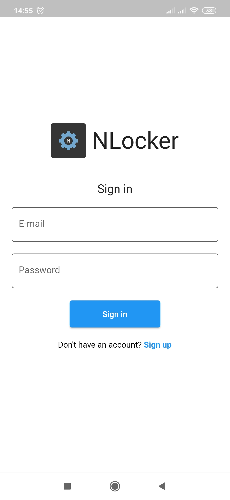
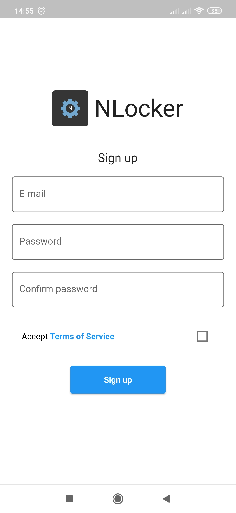
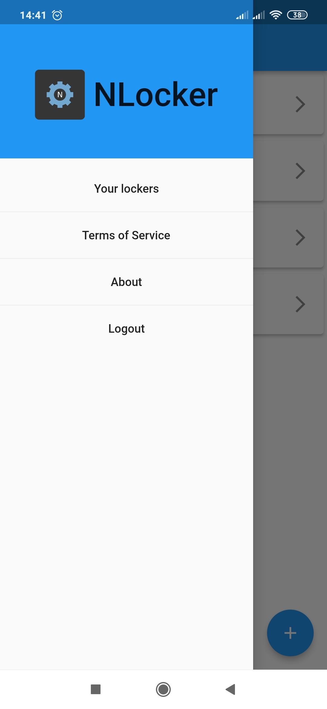
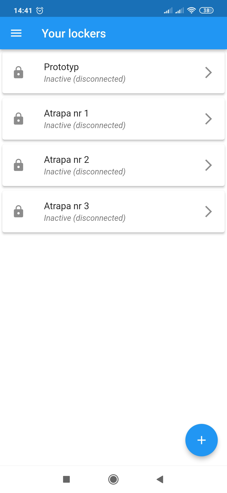
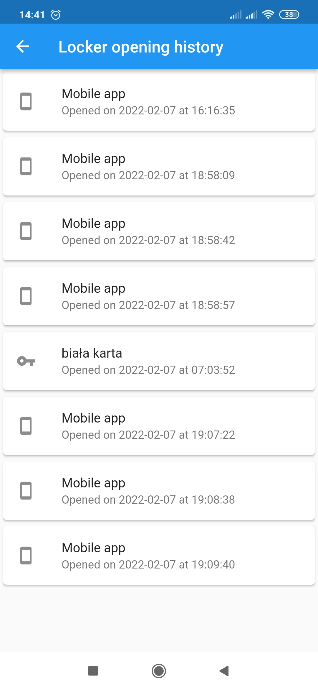
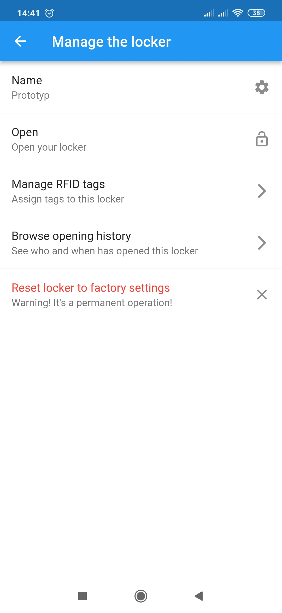
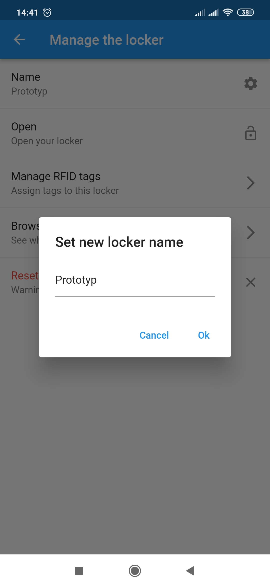
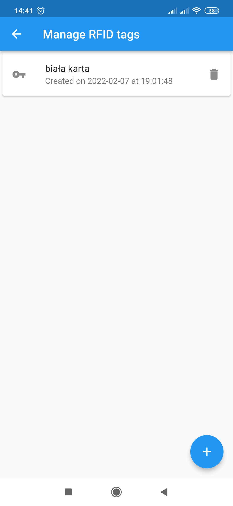
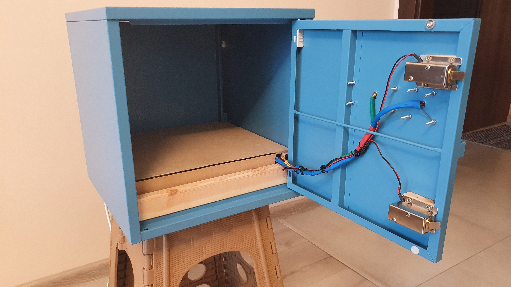
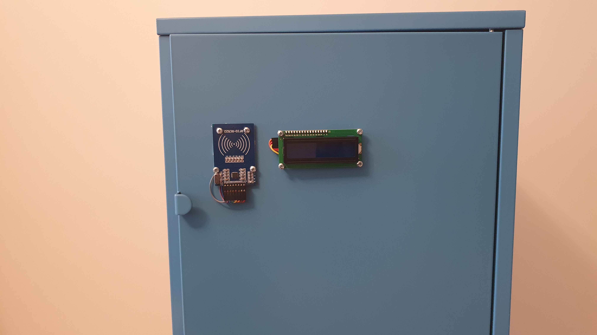

# nlocker
Projekt inteligentnej szafki, zarządzanej przy pomocy aplikacji mobilnej

## Opis
Szafka, znajdując się w stanie fabrycznym, rozgłasza własną sieć Wi-Fi o odpowiedniej nazwie (NLocker). Aby móc korzystać z szafki, użytkownik musi najpierw zainstalować dedykowaną aplikację mobilną i założyć konto w serwisie. W aplikacji mobilnej należy wcisnąć przycisk służący do dodania nowej szafki. Aplikacja prosi użytkownika i połączenie się z siecią Wi-Fi szafki. Teraz użytkownik powinien wybrać sieć Wi-Fi, w której szafka ma pracować na co dzień. W tym celu aplikacja wyświetla listę dostępnych sieci, a użytkownik wybiera jedną z nich, podaje hasło oraz nazwę, pod jaką ma figurować szafka. Jeżeli szafkę uda się poprawnie sparować, wyświetla ona odpowiedni komunikat.

Od tego momentu użytkownik może korzystać z szafki. Szafka może być otwierana nie tylko z sieci lokalnej, ale z dowolnego miejsca na świecie (pod warunkiem dostępu do internetu). Otworzyć szafkę można na dwa sposoby: przy pomocy aplikacji (wciskając odpowiedni przycisk) oraz przy pomocy tagu RFID (np. breloczka, albo legitymacji studenckiej). Pierwsza metoda działa od ręki, natomiast druga wymaga wcześniejszego sparowania tagu. Aby to zrobić, użytkownik z poziomu aplikacji inicjalizuje tryb parowania szafki, co szafka sygnalizuje na swoim wyświetlaczu, a następnie skanuje tag przy pomocy czytnika zintegrowanego z szafką. Użytkownik może przypisać spersonalizowaną nazwę sparowanemu tagowi. Sparowany tag, można później unieważnić (usunąć z listy tagów powiązanych z szafką)

Wszystkie zdarzenia związane z szafką (próby otwarcia) są rejestrowane i użytkownik może je wygodnie przeglądać.

Szafka została wykonana z wykorzystaniem platformy RaspberryPi.

## Zrzuty ekranu z aplikacji

## Zdjęcia szafki

## Architektura oprogramowania
Aplikacja mobilna komunikuje się przede wszystkim z serwerem. Ta komunikacja odbywa się poprzez REST API. Jedna aplikacja mobilna może komunikować się także bezpośrednio z szafką - odbywa się to jednak wyłącznie na etapie parowania szafki z danym kontem użytkownika.

Serwer i szafka komunikują się ze sobą dwiema metodami: poprzez REST API oraz poprzez WebSocket. Ta pierwsza jest używana w momencie, gdy szafka chce wysłać jakiś komunikat serwerowi, sama inicjując połączenie - czyli w przypadku, kiedy szafka znajduje się w domyślnym trybie i użytkownik zbliży do jej czytnika kartę - szafka wtedy wysyła zapytanie do serwera, by ten zdecydował, czy szafka powinna zostać otwarta. Druga z metod jest używana w odwrotnym przypadku, czyli kiedy to serwer ma zainicjować jakąś akcję. Użycie REST API nie było w tym przypadku możliwe, więc zdecydowaliśmy się na zastosowanie WebSocketów. Tak więc szafka po włączeniu się inicjuje połączenie z serwerem i jest ono utrzymywane przez cały czas działania szafki.

Istotnym aspektem jest kwestia bezpieczeństwa działania szafki. Dołożono dużych starań, aby szafka była jak najbardziej bezpieczna i nigdy nie doszło do przejęcia nad nią kontroli przez osoby postronne. W związku z tym wykorzystujemy wyłącznie szyfrowane połączenia (HTTPS, WSS) oraz generujemy kilka rodzajów tokenów, służących do uwierzytelniania aplikacji mobilnej/szafki na poszczególnych etapach komunikacji. Aby to lepiej zobrazować, przedstawiono w punktach kroki, jakie zostają wykonane w celu obsługi podstawowych funkcjonalności systemu.

### Parowanie szafki:
1. Użytkownik instaluje aplikację mobilną, rejestruje się i loguje, jeśli jeszcze tego nie zrobił. Zalogowanie się wymaga przesłania adresu e-mail oraz hasła do API, które zwraca wygenerowany token (nazwijmy go tokenem użytkownika). Token ten musi być przesyłany w każdym zapytaniu inicjowanym przez użytkownika.
2. Użytkownik klika przycisk plus, znajdujący się na widoku listy jego szafek
3. Użytkownikowi ukazuje się informacja o tym, że nie jest połączony z Wi-Fi rozgłaszanym przez szafkę. Aby móc kontynuować, musi się z nim połączyć (SSID tej sieci Wi-Fi to NLocker). Zanim to zrobi, aplikacja wysyła jednak do API prośbę o wygenerowanie specjalnego tokenu, zwanego tokenem parowania. To token o bardzo krótkim czasie ważności (5 minut), zostanie on wykorzystany przez szafkę w celu jej sparowania.
4. Aplikacja wykrywa, że użytkownik połączył się z siecią i prezentuje mu formularz, z poziomu którego użytkownik musi wybrać sieć Wi-Fi z którą ma zostać połączona szafka. Nazwę sieci może wybrać z listy, a hasło musi wpisać ręcznie. Następnie wciska przycisk zatwierdzający formularz. W tym kroku aplikacja komunikuje się z innym REST API, znajdującym się na szafkę. Po zatwierdzeniu formularze przesyła do tego API nazwę sieci, hasło do sieci, token parowania oraz zdefiniowaną przez użytkownika nazwę szafki.
5. Szafka próbuje się połączyć z siecią Wi-Fi przy pomocy podanego SSID i hasła. Jeżeli jej się uda, wysyła zapytanie do serwera, które dodaje ją do listy szafek użytkownika. Szafka uwierzytelnia się tu tokenem parowania. Użycie innego rodzaju tokenu było tu konieczne, ponieważ w sytuacji gdyby ktoś próbował podszywać się pod szafkę, przejęcie takiego tokenu nie umożliwi mu przejęcia całego konta użytkownika. Jeżeli dodanie szafki przebiegnie pomyślnie, serwer generuje trzeci rodzaj tokenu, zwany tokenem szafki. Ten token jest permanentny i jest on przechowywany na szafce tak długo, aż nie zostanie ona przywrócona do ustawień fabrycznych. Token ten musi zostać przesłany za każdym razem po inicjacji połączenia WebSocket. Uwierzytelnia on szafkę podczas komunikacji z serwerem. Jest to konieczne, szczególnie w momencie kiedy szafka odczytuje identyfikator tagu RFID i przesyła go do serwera. Gdyby ktoś w tym momencie podszył się pod szafkę, mógłby przesłać identyfikator własnej karty, co umożliwiłoby otwarcie szafki osobie postronnej.

### Otwarcie szafki z poziomu aplikacji:

1. Użytkownik klika odpowiedni przycisk w aplikacji
2. Aplikacja wysyła odpowiednie zapytanie poprzez REST API
3. Serwer, w kontrolerze obsługującym nadesłane zapytania wysyła komunikat do odpowiedniej szafki (należy pamiętać, że z serwer może być połączone wiele szafek) poprzez WebSocket.
4. Szafka odpowiada serwerowi, że wiadomość do niej doszła i że szafka została otwarta
5. Serwer zwraca aplikacji odpowiedź, że szafka została otwarta lub odpowiednio, że szafka nie jest połączona do serwera.

# Parowanie karty

1. Użytkownik inicjuje tryb parowania poprzez wciśnięcie przycisku dodającego nowy tag RFID
2. Aplikacja wysyła zapytanie do serwera poprzez API
3. Serwer w kontrolerze obsługującym zapytanie komunikuje się z szafką i każe jej przełączyć się w tryb parowania. Od tego momentu oczekuje na odpowiedź
4. Szafka przełącza się w tryb parowania i oczekuje na odczyt karty
5. Użytkownik przykłada kartę do czytnika szafki
6. Szafka odczytuje identyfikator karty i przesyła go z powrotem do serwera
7. Serwer zapisuje w bazie danych informację o karcie, jej nazwie, identyfikatorze i przypisaniu do danej szafki. Następnie serwer odpowiada aplikacji, że tag udało się pomyślnie dodać
8. Aplikacja prezentuje użytkownikowi odpowiedni komunikat.

